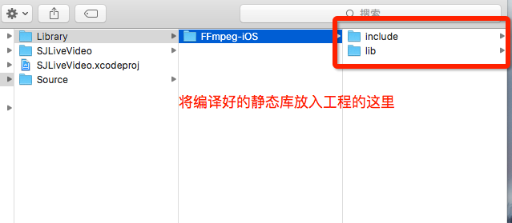

# FFmpegDemo
学习ffmpeg

#### 端午才开始研究,网上到处找,百度,谷歌,发现关于FFmpeg相关资料太少了,也就雷神的博客FFmpeg相关资料多

#### VideoToolBox资料更是少的可怜

#### 由于文件超过github的限制,所以移除了ffmpeg静态库

#### 自行下载 ffmpeg 脚本文件编译,并将编译好的静态库 放入对应的路径

[编译脚本](https://github.com/kewlbear/FFmpeg-iOS-build-script.git)

[百度云盘下载可运行](http://pan.baidu.com/s/1kVs9NxX) 密码: v9qm

[雷神博客](http://blog.csdn.net/leixiaohua1020/article/details/47072519)

